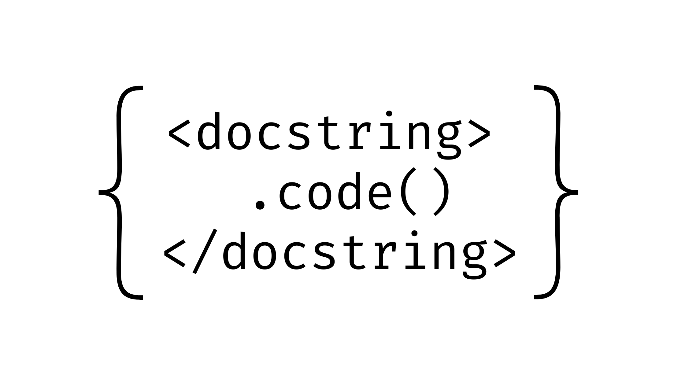

### Amazon to Scrap Local Alexa Processing: All Voice Commands Moving to the Cloud  

**Echo devices won’t process voice requests locally after March 28**  

Starting **March 28, 2025**, Amazon will **eliminate local voice processing** for Alexa users, forcing all requests to be processed via the cloud. Users who had enabled the "Do Not Send Voice Recordings" feature will **lose that option**, with no alternative to keep voice data local.  

Amazon has yet to formally announce the update on its official help pages, but users received email notifications over the weekend confirming the change. The company justifies the move by stating that **Alexa’s new generative AI features require cloud processing** due to the limited hardware capabilities of Echo devices.  

### **Local Processing No Longer an Option**  

Previously, **select Echo devices** (4th-gen Echo Dot, Echo Show 10, and Show 15) could process voice requests locally, offering an added layer of privacy. However, Amazon now claims that the demands of generative AI **exceed the capabilities** of these devices, making cloud-based processing the only viable option.  

For users who had enabled "Do Not Send Voice Recordings," the setting will automatically be updated to **"Don't save recordings."** However, this means **losing key features**, such as personalized responses through voice ID.  

> "Starting on March 28, your voice recordings will be sent to and processed in the cloud, and they will be deleted after Alexa processes your requests," Amazon informed users.  

### **Privacy Concerns and Amazon’s Track Record**  

While the **removal of local processing may concern privacy-conscious users**, Amazon insists that the shift won’t compromise security. However, past reports suggest that Alexa data has been used to **target ads** and that **third-party skills** often come with unclear data protection policies.  

This is just the latest in a string of Amazon privacy controversies. In recent years, the company has faced:  

- **Claims that Alexa voice data was stored indefinitely**, even after users attempted to delete it.  
- **FTC allegations** of mishandling Ring camera data, allowing unauthorized employee access to private video feeds.  
- **Lawsuits over data collection via advertising SDKs** and alleged privacy violations concerning children's voice recordings.  

Despite this, Amazon maintains that Alexa users will still have **plenty of privacy options**, though many require sacrificing key features.  

### **Generative AI and Alexa+ Subscription Model**  

This update coincides with **Alexa’s shift to a generative AI-powered model**, introduced alongside **Alexa+ in February**. The **AI-enhanced assistant requires cloud processing** and will only be available to **Amazon Prime users or those willing to pay $19.99 per month**.  

While **classic Alexa will remain**, both versions will require cloud-based voice processing—there’s no way to keep requests offline anymore.  

### **Final Thoughts**  

Amazon’s decision signals a **major shift toward cloud reliance**, effectively making Echo devices **internet-dependent** for voice commands. The move benefits **Amazon’s AI ambitions**, but at the cost of **privacy and offline functionality** for users.  

For those concerned about data privacy, this change reinforces the importance of **carefully managing device settings**—or reconsidering whether Alexa should be a part of their home at all.  

---  

### **Footnote: Need Automated Code Documentation?**  

If you're a developer looking for an **AI-powered documentation tool**, check out **[Penify](https://www.penify.dev)**. It **automates code documentation**, making it easier to manage and maintain projects. Say goodbye to manual documentation struggles—**Penify** does the heavy lifting for you! 🚀