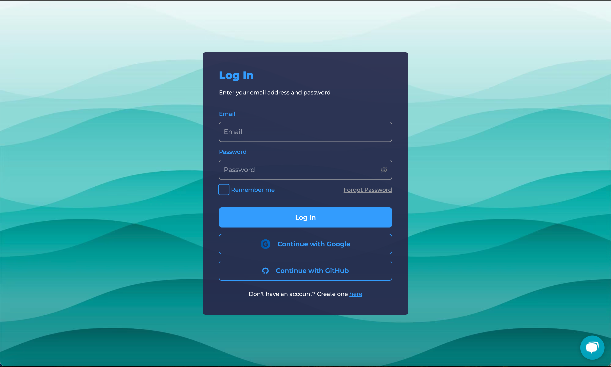
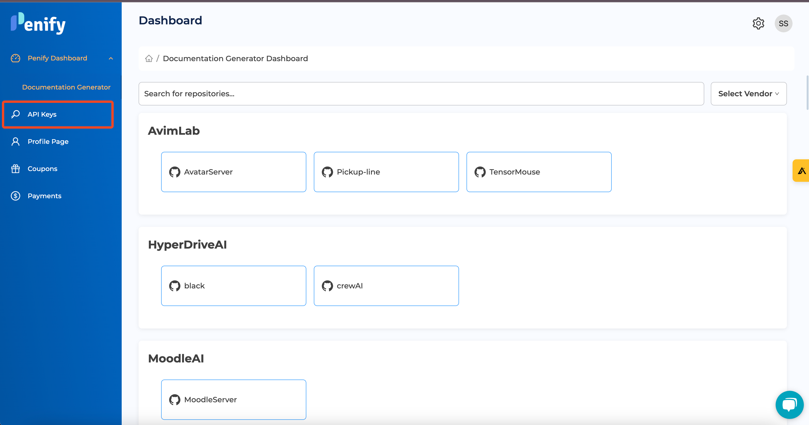
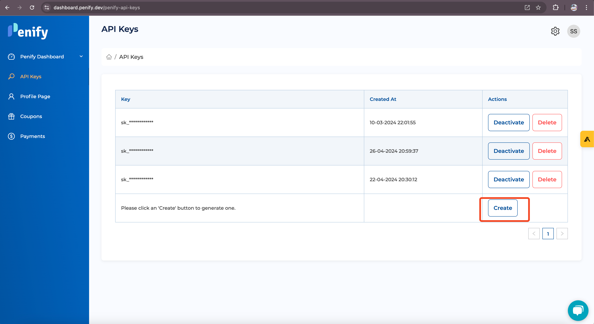
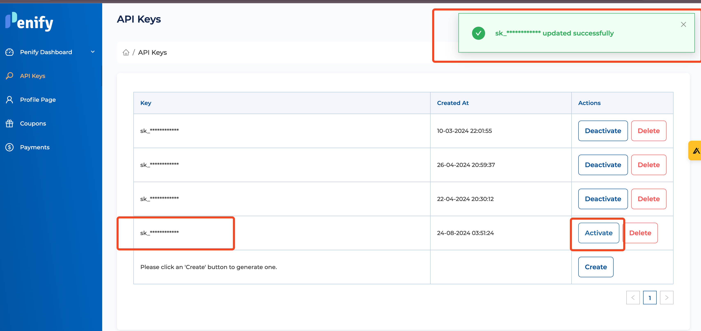

# **Creating API Keys in Penify**

In this tutorial, you'll learn how to create API keys in Penify, which are essential for authenticating and integrating Penify services with your applications. API keys allow you to interact with the Penify API securely, enabling features like automated code documentation generation, static analysis, and more.

## **Step 1: Log In to Your Penify Account**

1. Visit the [Penify Dashboard](https://dashboard.penify.dev).
2. Enter your credentials (email and password)/Google/Github to log in.

    <!-- Replace with actual image URL -->

## **Step 2: Navigate to the API Keys Section**

1. Once logged in, locate the sidebar on the left-hand side of the dashboard.
2. Click on **"API Keys"** under the **"Settings"** section.

    <!-- Replace with actual image URL -->

## **Step 3: Create a New API Key**

1. In the API Keys section, you'll see a button labeled **"Create"**. Click on it.

    <!-- Replace with actual image URL -->

2. It will automatically generate Api Key.

    <!-- Replace with actual image URL -->

## **Step 4: Copy and Store Your API Key Securely**

1. Once your API key is generated, it will be displayed on the screen. **Copy** this key immediately, as it will not be shown again for security reasons.

    <!-- Replace with actual image URL -->

2. Store the API key in a secure location, such as a password manager or environment variable file.

## **Step 5: Use the API Key in Your Project**

1. To use the API key in your project like Penify-Hook add it to your project's configuration file or environment variable:
   
   **Example in a `.env` file:**
   ```bash
   PENIFY_API_KEY=your_api_key_here
   ```

## **Step 6: Managing and Revoking API Keys**

1. You can manage your API keys at any time by returning to the **API Keys** section in the dashboard.
2. To revoke an API key, click on the **"Disable"** button next to the key you wish to disable.

    <!-- Replace with actual image URL -->

   **Note**: Revoked keys cannot be re-enabled. You will need to create a new key if necessary.

## **Conclusion**

You've successfully created and managed an API key in Penify! These keys are crucial for integrating Penify's powerful features into your development workflow. Remember to keep your API keys secure and never share them publicly.

Happy coding!!