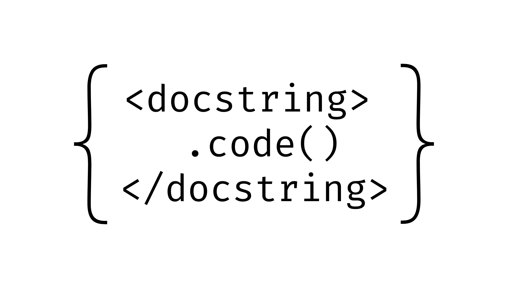

# The Evolution of Automated Source Code Documentation: A Decade in Review

In the fast-paced world of software development, clear and concise documentation is crucial. But let's face it – writing documentation is often seen as a chore. What if we could automate this process? Over the past decade, researchers have been working tirelessly to make this a reality. Let's dive into the fascinating world of automated source code documentation and see how far we've come.

## The Big Picture

Imagine a tool that could read your code and generate meaningful comments or even predict appropriate method names. Sounds like magic, right? Well, that's exactly what researchers have been working on. A recent comprehensive review paper has analyzed the progress in this field from 2010 to 2021, and the results are nothing short of impressive [1].

## From Templates to Deep Learning

In the early 2010s, researchers were using template-based approaches. These methods relied on predefined patterns to generate documentation. For example, Sridhara et al. (2010) developed a system that could automatically generate summaries for Java methods using carefully crafted templates [2].

As we moved into the middle of the decade, information retrieval (IR) techniques gained popularity. These approaches mined existing codebases and documentation to find relevant information for new code.

But the real game-changer came with the rise of machine learning, particularly deep learning. In 2016, Iyer et al. introduced CODE-NN, an attention-based neural network that could generate natural language summaries of code snippets [3]. This marked a significant shift in the field.

## The Java Dominance

Interestingly, Java has been the darling of code documentation research, featuring in 58% of the papers reviewed. Python comes in as a strong second. Why? Java's popularity among developers and its structured nature make it an ideal candidate for these studies.

## Measuring Success

How do we know if these automated systems are any good? Researchers use a combination of automatic metrics like BLEU (borrowed from machine translation) and human evaluation. For instance, LeClair et al. (2019) reported impressive BLEU-4 scores of 38.17 for their method summarization approach [4].

## The Power of Structure

One of the most exciting developments has been the incorporation of code structure into these models. By leveraging Abstract Syntax Trees (ASTs), researchers have been able to capture the hierarchical nature of code, leading to significant improvements in documentation quality. A great example is the code2seq model by Alon et al. (2019), which uses AST paths to generate method names and summaries [5].

## Challenges and Future Directions

Despite the progress, there are still hurdles to overcome. We need standardized datasets for fair comparisons between different approaches. There's also a call for more research into higher-level documentation, like class and package summaries.

The future looks bright, with researchers exploring cutting-edge techniques like transformers. Ahmad et al. (2020) have already shown promising results applying transformer models to code summarization [6].

## What Does This Mean for Developers?

Well we have built [Penify](https://www.penify.dev) to solve this problem and we have been a build an extremely powerful Contextual Engine that generates a great Code Documentation

So, the next time you're groaning about writing documentation, remember – we are here!

## References

[1] Rai, S., Belwal, R. C., & Gupta, A. (2022). A Review on Source Code Documentation. ACM Transactions on Intelligent Systems and Technology.

[2] Sridhara, G., Hill, E., Muppaneni, D., Pollock, L., & Vijay-Shanker, K. (2010). Towards automatically generating summary comments for java methods. In Proceedings of the IEEE/ACM international conference on Automated software engineering (pp. 43-52).

[3] Iyer, S., Konstas, I., Cheung, A., & Zettlemoyer, L. (2016). Summarizing source code using a neural attention model. In Proceedings of the 54th Annual Meeting of the Association for Computational Linguistics (Volume 1: Long Papers) (pp. 2073-2083).

[4] LeClair, A., Jiang, S., & McMillan, C. (2019). A neural model for generating natural language summaries of program subroutines. In Proceedings of the 41st International Conference on Software Engineering (pp. 795-806).

[5] Alon, U., Brody, S., Levy, O., & Yahav, E. (2019). code2seq: Generating sequences from structured representations of code. arXiv preprint arXiv:1808.01400.

[6] Ahmad, W. U., Chakraborty, S., Ray, B., & Chang, K. W. (2020). A transformer-based approach for source code summarization. arXiv preprint arXiv:2005.00653.