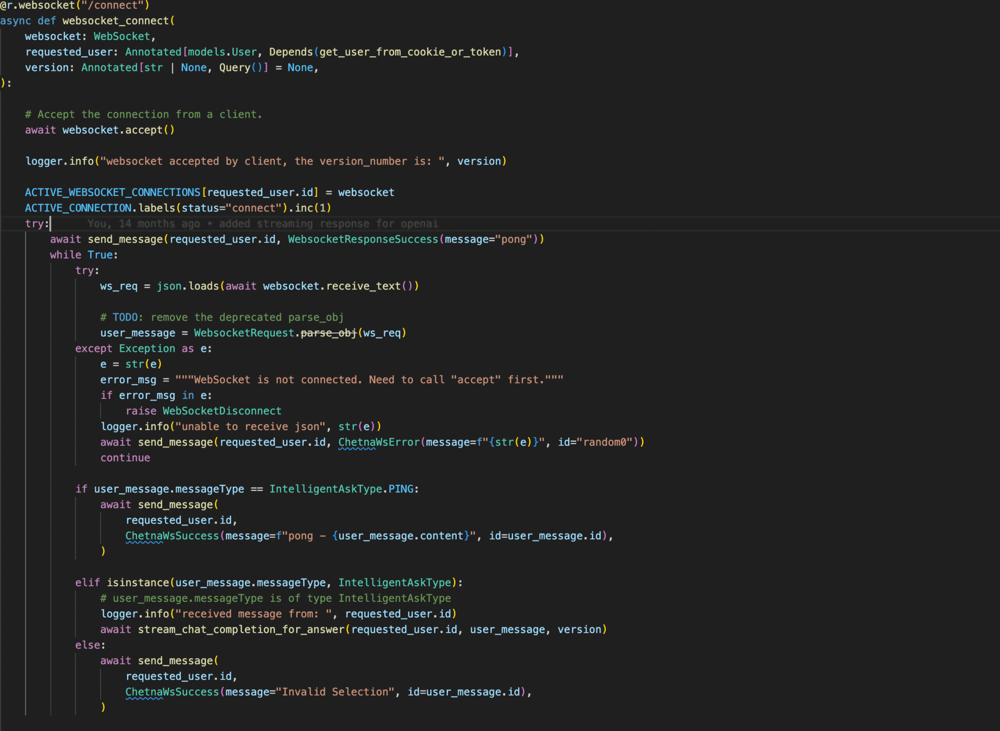
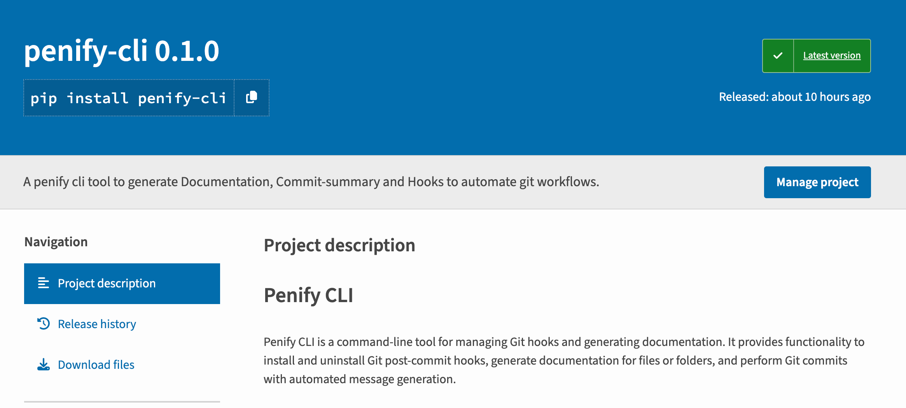
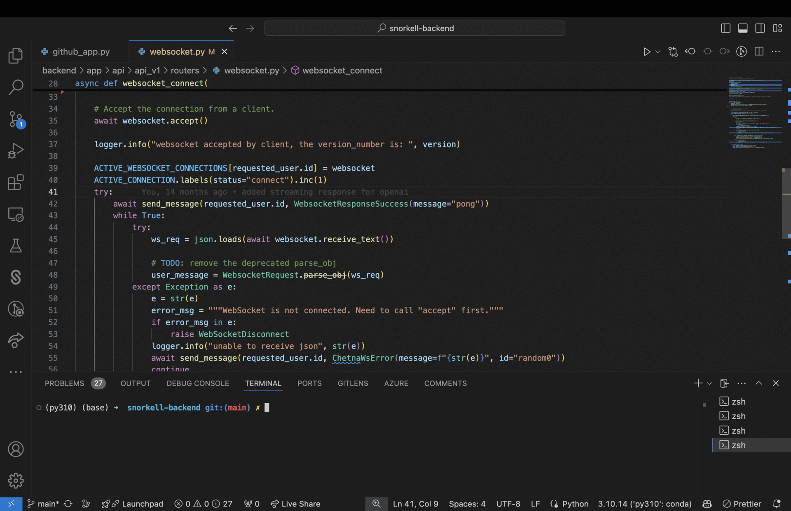
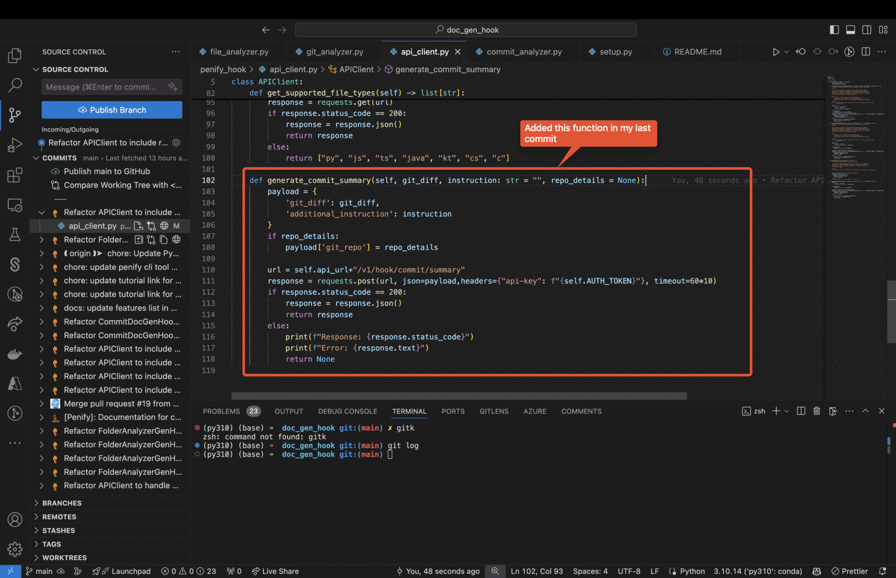

# Automate Code Documentation with Penify-CLI

In the fast-paced world of software development, maintaining comprehensive and up-to-date code documentation can often feel like a Herculean task. Enter Penify-CLI, a command-line tool designed to streamline and automate your documentation process. Let's dive into how this powerful tool can transform your development workflow.



## The Documentation Dilemma

We've all been there - staring at a piece of code, trying to decipher what it does and why it was written that way. Good documentation is the unsung hero of software development, playing a crucial role in:

1. Onboarding new team members
2. Maintaining and updating existing code
3. Facilitating collaboration among developers
4. Preserving knowledge as team members come and go

But let's face it, writing documentation is often seen as a chore. That's where Penify-CLI comes in.

## Introducing Penify-CLI

Penify-CLI is not just another documentation tool. It's your personal documentation assistant, powered by advanced AI to understand your code and generate meaningful documentation.



## Getting Started with Penify-CLI

First things first, let's get Penify-CLI installed:

```bash
pip install penify-cli
```

## Login

You can login using the command 

```bash
penify-cli login
```

or else you can manually set the token by following this tutorial: [tutorial](https://docs.penify.dev/docs/Creating-API-Keys-in-Penify.html) 

## Generating Documentation:

Penify-CLI offers multiple ways to generate documentation, catering to different needs:

### 1. For a Single File

```bash
penify-cli doc-gen -fl /path/to/your/file.type
```



### 2. For an Entire Folder

```bash
penify-cli doc-gen -cf /path/to/your/folder
```


### 3. For Recent Git Changes

```bash
penify-cli doc-gen -gf /path/to/your/git/repo
```



## The Magic Behind Penify-CLI

Penify-CLI isn't just about automating documentation - it's about understanding your code. Using advanced natural language processing and machine learning algorithms, Penify-CLI:

1. Analyzes your code structure
2. Understands the purpose of functions and classes
3. Identifies relationships between different parts of your codebase
4. Generates context-aware, meaningful documentation

[Image: A flowchart showing the process of Penify-CLI analyzing code and generating documentation]

## Real-World Benefits

Let's look at some tangible benefits of using Penify-CLI:

1. **Time-Saving**: Reduce documentation time by up to 70%
2. **Consistency**: Ensure uniform documentation style across your project
3. **Up-to-Date**: Easily regenerate documentation as your code evolves
4. **Comprehensive**: Capture details that might be overlooked in manual documentation

[Image: Before/After comparison of a piece of code without and with Penify-CLI generated documentation]

## Best Practices for Using Penify-CLI

To get the most out of Penify-CLI:

1. Run it regularly, ideally as part of your CI/CD pipeline
2. Review and refine the generated documentation
3. Use it in conjunction with inline comments for the best results
4. Customize the output to fit your team's documentation standards

## Conclusion

Penify-CLI is more than just a tool - it's a paradigm shift in how we approach code documentation. By automating the tedious parts of documentation, it frees developers to focus on what they do best - writing great code.

Give Penify-CLI a try and experience the difference it can make in your development workflow. Your future self (and your team) will thank you!

