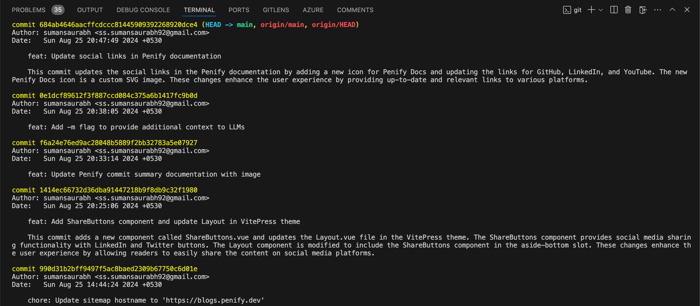
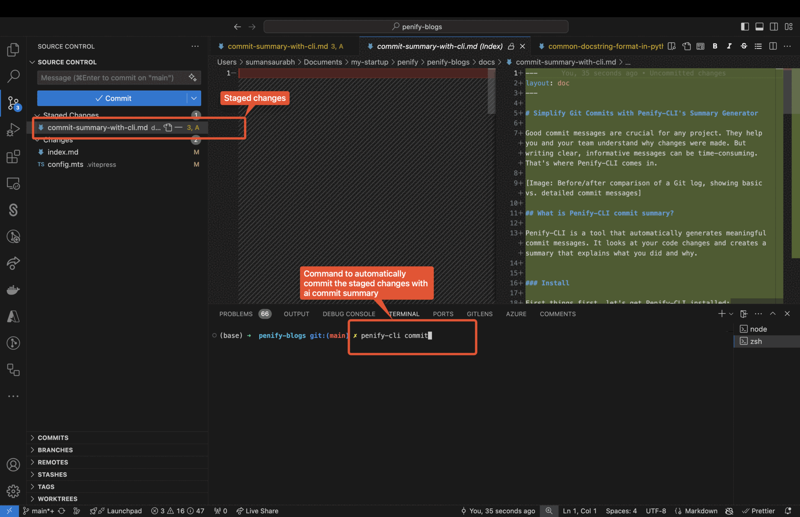
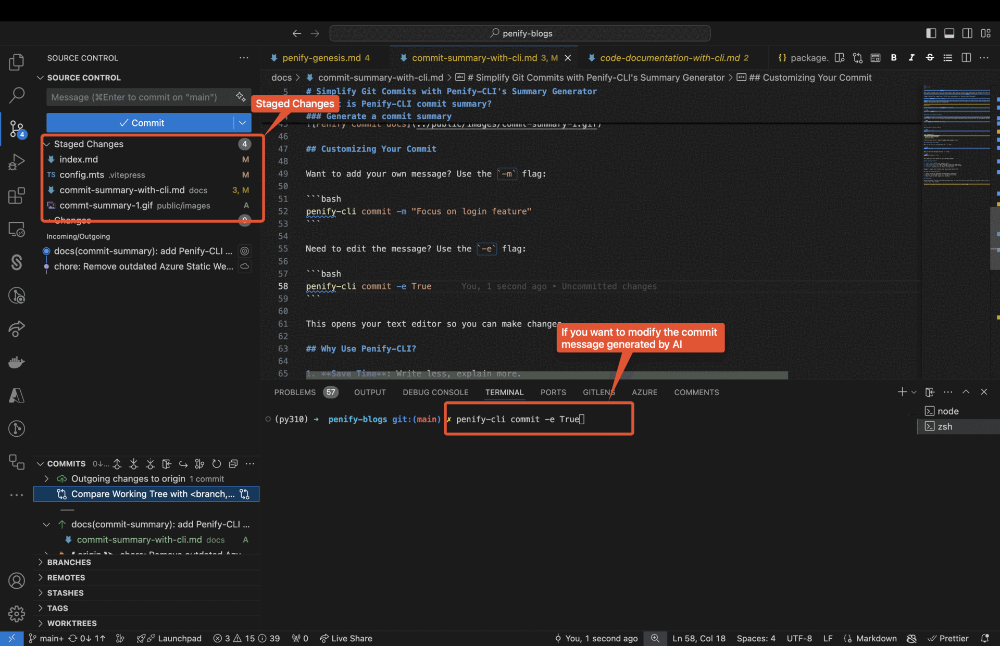

# Simplify Git Commits with Penify-CLI's Summary Generator

Good commit messages are crucial for any project. They help you and your team understand why changes were made. But writing clear, informative messages can be time-consuming. That's where Penify-CLI comes in.



## What is Penify-CLI commit summary?

Penify-CLI is a tool that automatically generates meaningful commit messages. It looks at your code changes and creates a summary that explains what you did and why.

### Install

First things first, let's get Penify-CLI installed:

```bash
pip install penify-cli
```

### Setup Environment Variables

- `PENIFY_API_TOKEN`: You can set this environment variable with your API token to avoid passing it as an argument each time. Here is the [tutorial](https://docs.penify.dev/docs/Creating-API-Keys-in-Penify.html) on setting env variables

```bash
export PENIFY_API_TOKEN=skl_ai_******
```

---

### Generate a commit summary

  1. Go to your repository

```bash
cd path/to/your/repo
```

  2. Make some changes and stage your changes

```bash
git add /all/your/files
```

  3. Only after you perform `git add`, Penify can pick your changes to automatically generate AI summary.

  ```bash
  penify-cli commit
  ```

This command will:

- Look at your code changes
- Create a commit message
- Make the commit



## Customizing Your Commit

1. Want to provide additional context to LLMs? Use the `-m` flag:

    ```bash
    penify-cli commit -m "Focus on login feature"
    ```

    While generating commit summary it will prioritizes your commit message

2. Need to edit the message? Use the `-e` flag:

    ```bash
    penify-cli commit -e True
    ```

    This opens your text editor so you can make changes.

    

## Why Use Penify-CLI?

1. **Save Time**: Write less, explain more.
2. **Be Consistent**: All commit messages follow the same style.
3. **Don't Miss Details**: The AI catches things you might forget.
4. **Learn**: Improve your own commit writing skills.

## Tips for Using Penify-CLI

1. Always review the generated message before committing.
2. Use your own message (with `-m`) to add extra context.
3. Make it part of your regular Git workflow.

## Conclusion

Penify-CLI makes writing good commit messages easy. It saves you time and helps keep your project history clear. Give it a try on your next commit!


