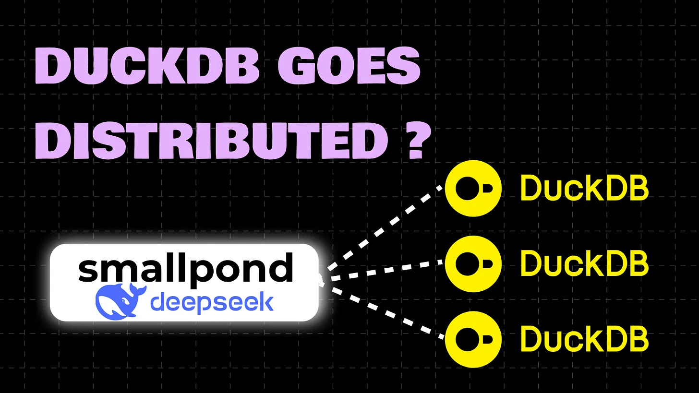
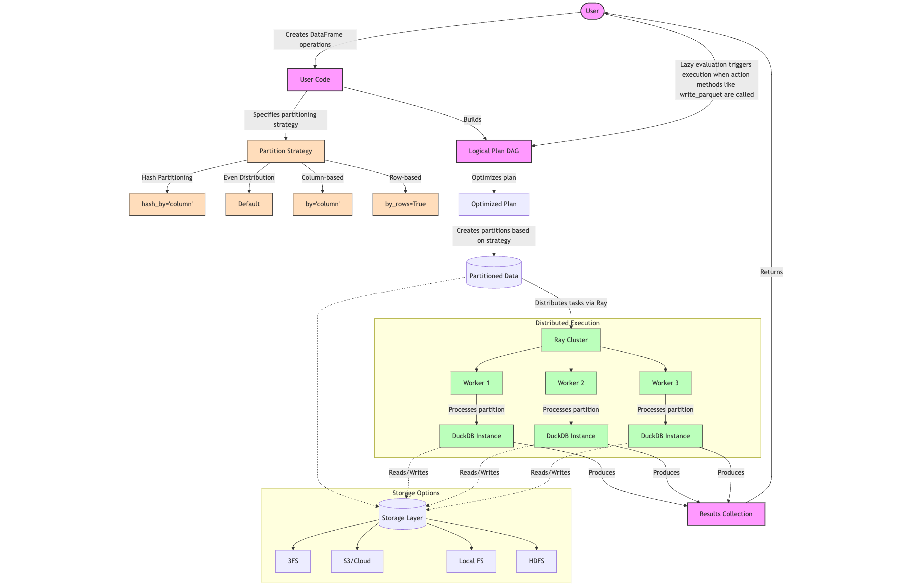
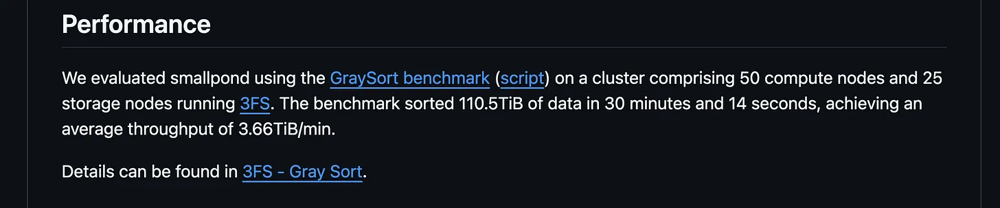
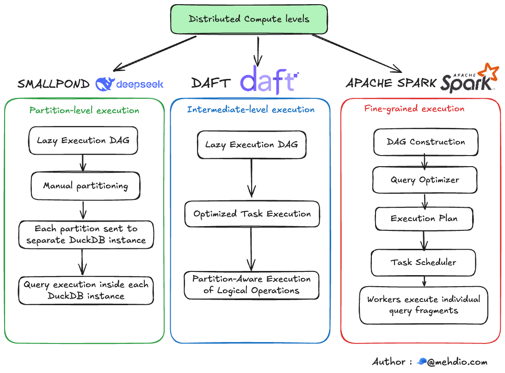

# DeepSeek’s Smallpond: Extending DuckDB for Distributed Big Data Processing




### Key Points
- It seems likely that DeepSeek’s smallpond extends DuckDB for distributed computing, handling large datasets like 110.5 terabytes efficiently.
- Research suggests smallpond uses Ray Core for distribution and supports various storage options, with 3FS offering high performance.
- The evidence leans toward smallpond being simpler than frameworks like Spark, but it may have trade-offs for complex queries.


#### Introduction
DeepSeek AI, recognized for its efficient AI model R1 released in January 2025, has recently launched smallpond, a distributed compute framework built on DuckDB. This development, detailed in a blog post by mehdio on February 28, 2025, aims to push DuckDB beyond its single-node roots to handle large-scale data processing, particularly for AI workloads. This survey note explores smallpond’s architecture, performance, and implications, providing a comprehensive analysis for data engineers and AI practitioners.

#### Background on DuckDB
DuckDB is an in-process analytical database, similar to SQLite but optimized for analytics. It runs within applications without a separate server, making it easy to install via libraries in languages like Python. Built in C++, it supports integrations with AWS S3, Google Cloud Storage, Parquet, Iceberg, and spatial data, and is known for high performance on large datasets. For example, in Python, users can query Parquet files with simple commands:

```python
import duckdb
conn = duckdb.connect()
conn.sql("SELECT * FROM '/path/to/file.parquet'")
```

It also seamlessly integrates with Pandas and Polars DataFrames using Arrow, enabling zero-copy operations. This makes DuckDB a popular choice for data exploration, especially in AI companies like HuggingFace, which use it for dataset viewing.

#### Smallpond: Distributed Computing for DuckDB
Smallpond extends DuckDB’s capabilities to distributed computing, addressing the need for processing terabyte-scale datasets. DeepSeek’s benchmark claims smallpond sorted 110.5 terabytes in 30 minutes and 14 seconds, achieving 3.66 terabytes per minute throughput, a significant leap from DuckDB’s single-node focus, where it previously handled 500GB efficiently in benchmarks like Clickbench.

The framework is open-source, available at [smallpond GitHub Repository](https://github.com/deepseek-ai/smallpond), and supports Python versions 3.8 to 3.12, installable via `pip install smallpond`. This aligns with DuckDB’s philosophy of simplicity, aiming to scale without the complexity of traditional big data frameworks.

#### Architecture and Execution Model
Smallpond’s architecture is built around a DAG-based execution model with lazy evaluation. Operations like `map()`, `filter()`, and `partial_sql()` are deferred, constructing a logical plan as a directed acyclic graph (DAG). Execution is triggered by actions like `write_parquet()`, `to_pandas()`, `compute()`, `count()`, or `take()`, optimizing performance by avoiding redundant computations.

Distribution is powered by Ray Core, a popular Python framework for distributed computing. Smallpond creates separate DuckDB instances within Ray tasks for each data partition, processing them independently using SQL queries. This approach prioritizes scaling out (adding nodes) over scaling up (enhancing single-node performance), requiring a Ray cluster, which can be managed via AWS, GCP, Kubernetes, or Anyscale’s managed service.




#### Partitioning Strategies
Smallpond offers flexible partitioning strategies to distribute data:
- **Hash Partitioning**: By column values, ensuring related data stays together.
- **Even Partitioning**: By files or rows, for balanced distribution.
- **Random Shuffle Partitioning**: For random data distribution across nodes.

This manual partitioning contrasts with automatic partitioning in some frameworks, giving users control but requiring careful planning for optimal performance.

#### Storage Options and Performance
Storage is a critical component, with smallpond supporting local filesystems, cloud storage like Amazon S3, HDFS, and DeepSeek’s 3FS. The benchmark’s impressive performance (110.5 terabytes in 30 minutes) was achieved using 3FS, a high-performance distributed file system designed for AI workloads. 3FS leverages SSDs and RDMA networks for low-latency, high-throughput storage, supporting random access and strong consistency, ideal for AI training.

However, deploying 3FS requires setting up a cluster, adding operational complexity, with no fully managed option currently available. For users opting for S3 or other storage, performance may not match 3FS, as noted in the blog, making it a trade-off between ease of use and performance.



#### Comparison with Other Frameworks
Smallpond differs from frameworks like Apache Spark or Daft, which distribute work at the query execution level (e.g., breaking down joins or aggregations). Smallpond operates at a higher level, distributing entire partitions to workers, each running DuckDB independently. This simplicity reduces complexity but may be less optimized for complex queries requiring finer-grained distribution.

For example, Spark’s operation-level distribution can better handle intricate query plans, while smallpond’s approach is more akin to processing files or partitions, as seen in serverless implementations like AWS Lambda, discussed in Julien Hurault’s blog on Okta’s multi-engine data stack.




#### Trade-offs and Limitations
While smallpond simplifies distributed computing, it introduces trade-offs:
- **Cluster Management**: Requires a Ray cluster, adding monitoring overhead, mitigated by managed services like Anyscale but still a cost.
- **Storage Dependency**: High performance relies on 3FS, which may not be practical for all users, especially without managed options.
- **Query Complexity**: Coarser distribution may underperform for queries needing fine-grained optimization, potentially limiting its use for advanced analytics.

#### Alternative Approaches to Scaling DuckDB
The blog highlights other ways to scale DuckDB, such as:
- **Serverless Functions**: Like AWS Lambda, processing data file by file, as implemented by Okta, detailed at [Okta’s Multi-Engine Data Stack](https://julienhurault.com/blog/oktas-multi-engine-data-stack).
- **MotherDuck**: A cloud-based version with dual execution, balancing local and remote compute, offering a different approach to scalability.

These alternatives suggest a landscape where scaling DuckDB can be achieved in multiple ways, depending on user needs and infrastructure.

#### Implications for AI and Data Engineering
Smallpond’s integration with DuckDB is particularly relevant for AI workflows, where data engineering is often the first step for training, retrieval-augmented generation (RAG), or other applications. By enabling distributed processing, smallpond reduces the need for heavy frameworks like Spark, potentially lowering cloud costs and improving developer experience, especially for datasets under 10TB, aligning with 94% of use cases per Redshift statistics.

#### Conclusion
Smallpond represents an innovative approach to scaling DuckDB for distributed big data processing, leveraging Ray and 3FS for high performance. Its simplicity and flexibility make it appealing for AI-heavy workloads, but trade-offs like 3FS dependency and cluster management highlight the need for careful consideration. As data grows, smallpond offers a lightweight, scalable option, complementing other methods like serverless functions and managed services, shaping the future of data engineering in AI.

#### Table: Smallpond Key Features and Comparisons

| Feature                          | Description                                      | Comparison to Spark/Daft         |
|-----------------------------------|--------------------------------------------------|-----------------------------------|
| Execution Model                  | DAG-based, lazy evaluation                      | Finer-grained in Spark/Daft      |
| Distribution Mechanism            | Ray Core, partition-level                       | Operation-level in Spark/Daft    |
| Partitioning Strategies          | Hash, even, random shuffle                      | Automatic in Spark, manual here  |
| Storage Options                  | Local, S3, HDFS, 3FS (high performance)          | Broad support, similar           |
| Benchmark Performance            | 110.5TB sorted in 30m14s, 3.66TB/min throughput | Varies, often slower for complex |

#### Key Citations
- [smallpond GitHub Repository: A lightweight data processing framework built on DuckDB and 3FS](https://github.com/deepseek-ai/smallpond)
- [DeepSeek AI Releases Smallpond: A Lightweight Data Processing Framework Built on DuckDB and 3FS](https://www.marktechpost.com/2025/03/02/deepseek-ai-releases-smallpond-a-lightweight-data-processing-framework-built-on-duckdb-and-3fs/)
- [DuckDB goes distributed? DeepSeek’s smallpond takes on Big Data](https://mehdio.substack.com/p/duckdb-goes-distributed-deepseeks)
- [DeepSeek's smallpond: Bringing Distributed Computing to DuckDB | Hacker News](https://news.ycombinator.com/item?id=43248947)
- [Okta’s Multi-Engine Data Stack](https://julienhurault.com/blog/oktas-multi-engine-data-stack)