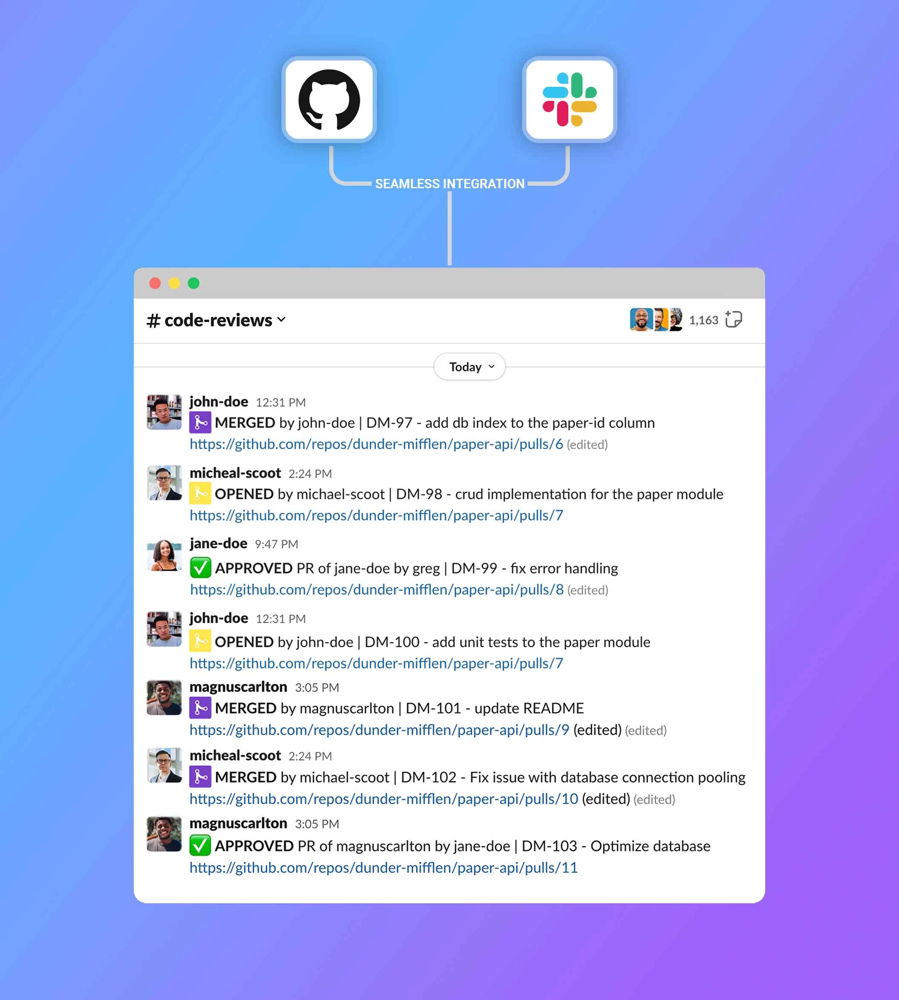

# NEVER Have to Beg for Code Reviews Again

It was one of those mornings where I just wanted to get stuff done. I’d spent hours the night before polishing a new feature for our app—a sleek little UI tweak I was honestly pretty excited about. I pushed the pull request, sipped my coffee, and then came the part I hated: asking for a review.

I stared at our team’s Slack channel, cursor blinking. Mark was debugging a production issue, Lena was buried in tickets, Tom was probably on his third call of the day. I didn’t want to derail anyone, but I needed that review. So I swallowed my hesitation and typed:

> “Morning team! Just dropped a PR for the UI tweak—anyone have a sec to check it out?”

I hit send. Five minutes. Ten. Nothing. My message just sat there, slowly sinking beneath the noise. Soon, Lena posted her own review request. Then Mark. Then Tom. Slack turned into a flood of “Can someone review my PR?” messages—and mine was long buried.

I didn’t want to nag. Following up felt pushy. But I was stuck.

That’s when I realized: the problem wasn’t my team—it was the way we communicated about code reviews. Slack just wasn’t built for this.

So I built [**PullNotifier**](https://pullnotifier.com/) — a Slack app that makes pull requests impossible to miss.

Instead of getting buried, PRs show up in a clean, structured feed with:

- ✅ Grouped PRs by author and status
- 🔔 Smart notifications when action is needed
- 🧼 Zero spam — no duplicate pings or clutter
- 📊 Insights into what's waiting for review, and what's getting ignored

Since we started using it, our review turnaround time has dropped significantly. No more begging. No more Slack spam. Just visibility.

If you’re tired of reviews being the bottleneck, [try it free](https://pullnotifier.com/). Your team will thank you.

## Gabriel's Moment of Truth

My friend [Gabriel](https://www.linkedin.com/in/gabriel-manta), a Director at Manta Tech, built this product. He was frustrated with the chaotic nature of pull request notifications, so he spent an afternoon streamlining the process. It's a great product, and we're using it at [Penify](https://www.penify.dev).
