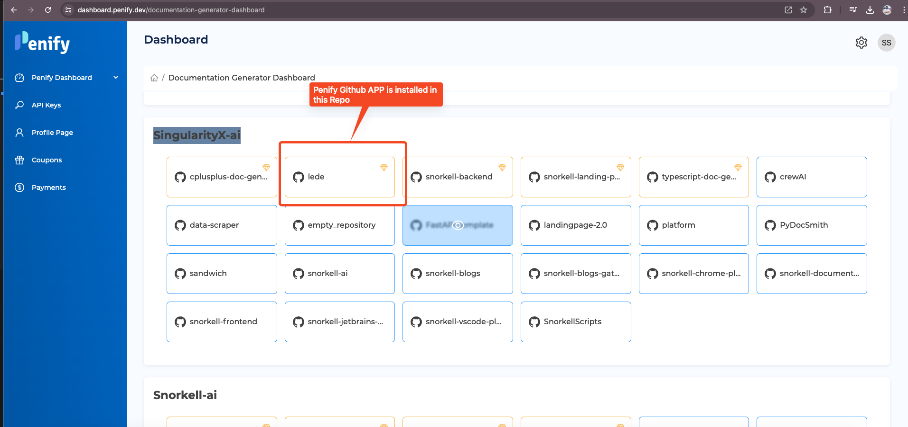
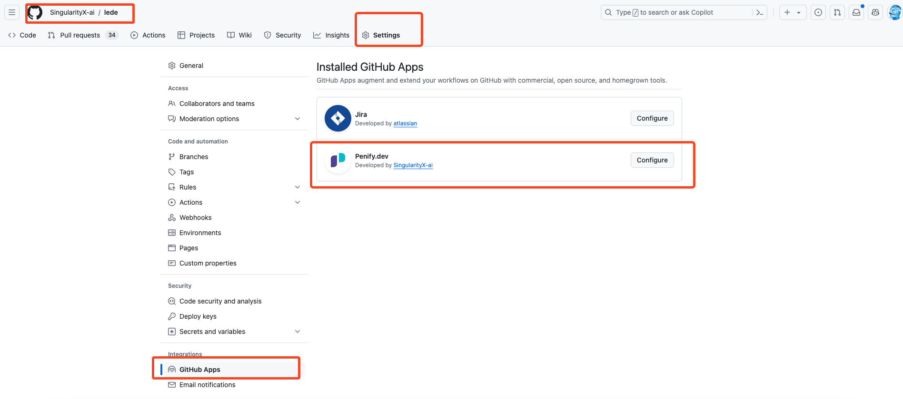

# 🚀 Troubleshooting Guide for Penify Code Git Commit Documentation

## Introduction

Whenever a Pull Request is merged to main/master branch. Penify will generate a new PR containing updated documentation.
This guide aims to help you troubleshoot common issues you may encounter when installing and configuring the Penify GitHub App for Git Commit Documentation.

We'll cover topics related to GitHub workflows and GitHub secrets, providing step-by-step solutions to ensure a smooth installation and usage experience.


## 🧩 GitHub App Installation Issues - [Video](https://youtu.be/CEUUbD9yYqI)

### 🚨 Problem: App is not correctly installed

**Symptoms:**

- Check if your repository is appearing in the [Penify Dashboard](https://dashboard.penify.dev/documentation-generator-dashboard).

  
- Check if the `Penify.dev` app is appearing on your repository's App Installation Page.

  

- If either of them is missing, you need to install the [Penify App](https://github.com/apps/penify-dev) again.

## ⚙️ GitHub Workflow Issues

### 🛠️ Problem: Workflow File Not Committed

**Symptoms:**

- The workflow file `snorkell-auto-documentation.yml` is not appearing in the `.github/workflows` directory.
- No pull request is created for the workflow file.

**Solutions:**

1. **✅ Check Pull Request:**
   - Ensure that the Penify app installation process has completed successfully. It will create a Pull Request with the name - `[Penify]: Setting up Automated AI-Driven Documentation for GitHub!`
   - If the PR is open, please merge the Pull Request to add the workflow file to your repository.
2. **🔍 Manual Workflow File Check:**
   - Verify if the workflow file `snorkell-auto-documentation.yml` exists in the `.github/workflows` directory of your repository.
3. **📝 Check the Content of the Workflow File:**
   - Ensure the content of the workflow file is correct. It should include the necessary configurations for the Snorkell documentation generation process.
   - Verify that placeholders such as `:::BRANCH_NAME:::` are replaced with the appropriate base branch name. The content should resemble the following template:

     ```yaml
      name: Penify - Revolutionizing Documentation on GitHub
      
      on:
         push:
         branches: [":::BRANCH_NAME:::"]
         workflow_dispatch:
      
      jobs:
         Documentation:
         runs-on: ubuntu-latest
         steps:
         - name: Penify DocGen Client
            uses: SingularityX-ai/snorkell-documentation-client@v1.0.0
            with:
               client_id: ${{ secrets.SNORKELL_CLIENT_ID }}
               api_key: ${{ secrets.SNORKELL_API_KEY }}
               branch_name: "main"
      ```

   - If the above file is not present, please create a file `.github/workflows/snorkell-auto-documentation.yml` and add the above content.

4. **🔐 Repository Permissions:**
   - Ensure that the Penify app has the necessary permissions to write to the repository. Check the repository settings under `Settings > Integrations > Installed GitHub Apps`.

-------

### 🚀 Problem: Workflow Not Triggering

**Symptoms:**

- The workflow does not trigger after merging the pull request.
- No automated documentation is generated.

**Solutions:**

1. **⚙️ Workflow Activation:**
   - Ensure that the workflow is enabled in the `Actions` tab of your GitHub repository.
   - Url format would be - https://github.com/{org_name}/{repo_name}/actions/

2. **🔧 Repository Settings:**
   - Ensure that GitHub Actions are enabled for your repository. Check the Github Actions are getting triggered or not  

## 🔐 GitHub Secrets Issues

### 🛠️ Problem: Secrets Not Set

**Symptoms:**

- The necessary secrets (`SNORKELL_API_KEY` and `SNORKELL_CLIENT_ID`) are not present in the repository settings.
- Workflow fails due to missing secrets.

**Solutions:**

1. **🔑 Manual Secret Addition:**
   - Manually add the secrets to your repository settings. Navigate to `Settings > Secrets and variables > Actions` and add `SNORKELL_API_KEY` and `SNORKELL_CLIENT_ID` with the appropriate values.
2. **🔍 Secrets keys are not present or incorrect:**
   - If the secret `SNORKELL_API_KEY` is not present, go to [Penify API Keys](https://dashboard.penify.dev/penify-api-keys) generate a secret key and add the value in the content section.
   - If the secret `SNORKELL_CLIENT_ID` is not present.
     - Go to [Penify Dashboard](https://dashboard.penify.dev/documentation-generator-dashboard)
     - Select your repository
     - Check the url - `https://dashboard.penify.dev/documentation-generator-dashboard/{org_name}/{repo_name}?id={client_id}`
     - `client_id` is your `SNORKELL_CLIENT_ID`
     - Don't worry this `SNORKELL_CLIENT_ID` is not actually a secret and can easily be shared.

### 📞 Contact Support

If the above solutions do not resolve your issues, contact Penify support with detailed information about the problem. Include logs, error messages, and steps you have already taken.

By following this troubleshooting guide, you should be able to resolve common issues related to GitHub workflows and secrets when installing and configuring the Penify GitHub App.