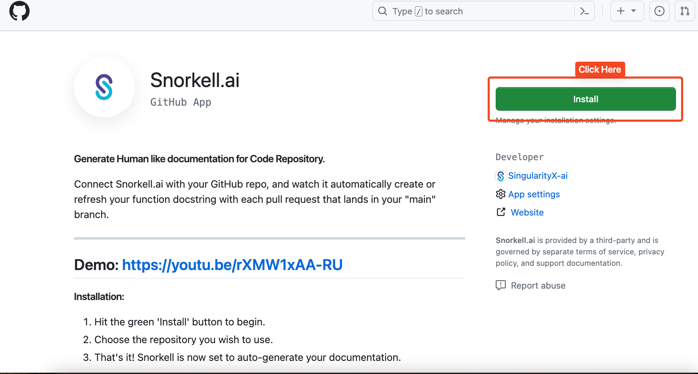
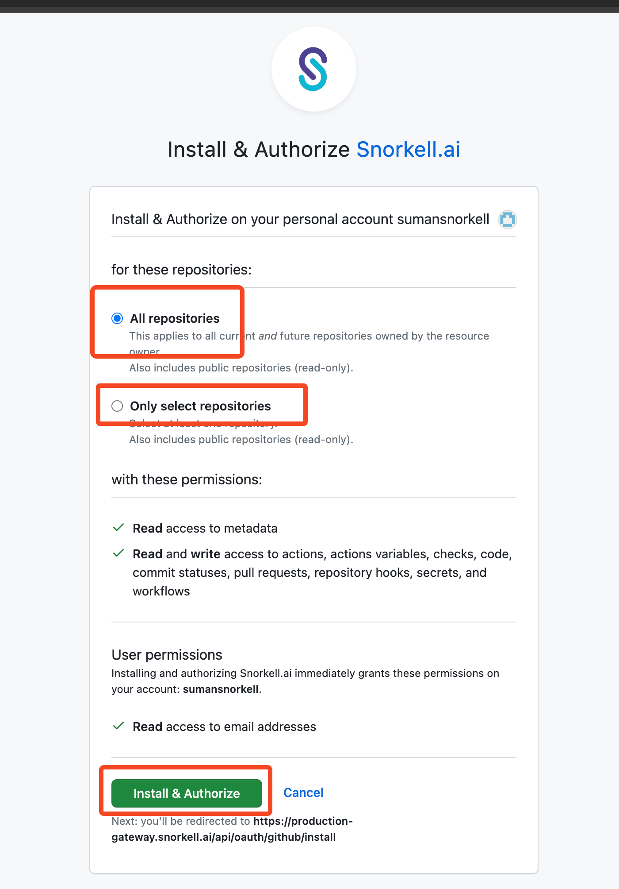

# What's Penify?

Penify is an intelligent GitHub App designed to automate the process of generating and updating documentation for GitHub projects. 

It activates automatically after installation, tracking changes every time a pull request is merged. Penify recognizes new classes and functions in the code and crafts or updates documentation accordingly, creating a PR for review before merging.

This tool saves time, ensures documentation consistency, and simplifies onboarding for new team members by keeping documentation in sync with code changes. It's ideal for startups, large teams, and open source projects.

## 🛠️ How to Install Penify on GitHub?

Installing Penify on your GitHub repository or organization is a straightforward process. This guide will walk you through the steps to integrate Penify, ensuring your project's documentation is automatically generated and updated.

### 📋 Pre-requisites

- A GitHub account.
- Administrative access to the repository or organization where Penify will be installed.
- If you don't have admin privilege, you can choose another path by clicking on this link.

### 🧭 Step-by-Step Installation Guide

1. **Log In to GitHub**
   - Open your web browser and navigate to [GitHub](https://github.com/).
   - Sign in to your GitHub account. 🔑

2. **Access the Penify GitHub App Page**
   - Go to the Penify app page [Github App](https://github.com/apps/penify-dev).
   - It can also be found through the GitHub Marketplace or by visiting the Penify website and selecting the option to install.

3. **Initiate Installation**
   - Click on the green ‘Install’ 🟢. This will redirect you to a page where you can choose where to install Penify.
  
    

4. **Select Installation Target** 🏢
   - Choose whether to install Penify for your personal account or for an organization.  
   - If you manage multiple organizations or repositories, select the ones where you wish to install Penify.

    

5. **Configure Permissions**
   - Review the permissions requested by Penify. These permissions are necessary for the app to access your code and generate documentation. 🔒
   - Grant the necessary permissions by clicking ‘Approve & install’ or a similar confirmation button.

6. **Complete Installation**
   - Once you approve the permissions, Penify will be installed on your selected repositories or organization. ✅
   - You will receive a confirmation message, and you may be redirected to [Penify Dashboard](https://dashboard.penify.ai/).

7. **Verify Installation**
   - Go to the ‘Settings’ of your repository or organization.
   - Navigate to the ‘Installed GitHub Apps’ section to confirm that Penify is listed there.

8. **Start Using Penify**
   - Once installed, Penify will automatically start tracking pull requests and generate or update documentation accordingly. 📚

### 🎥 Demo - Github

